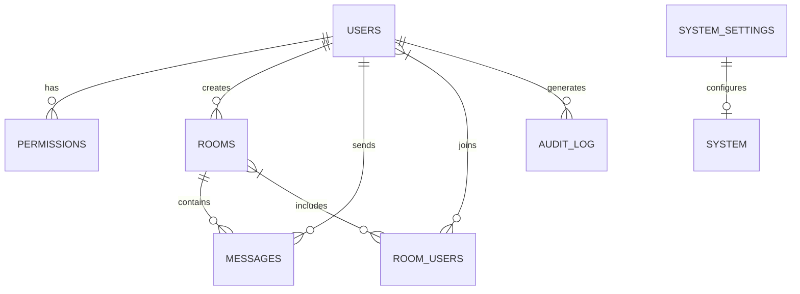
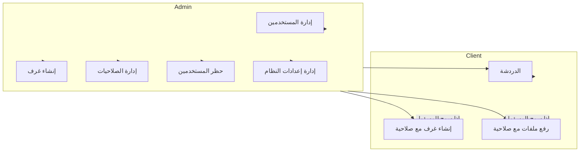
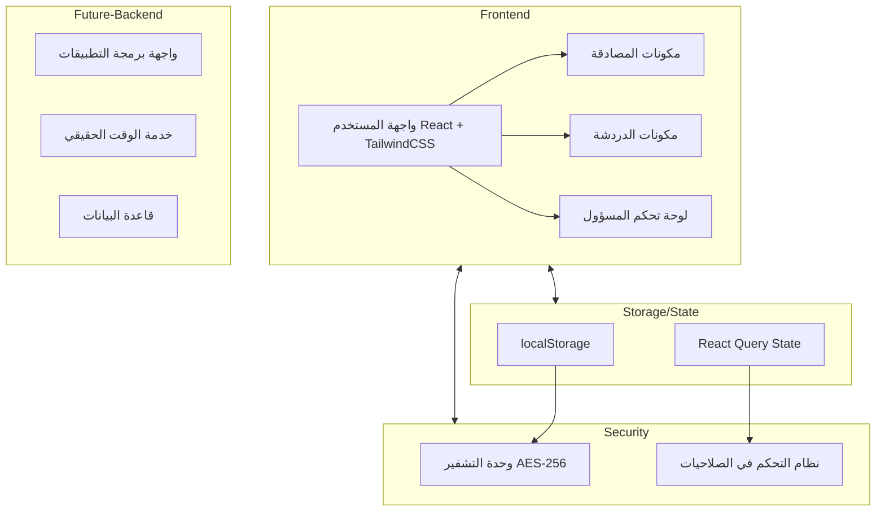

# 🔐 نظام دردشة مشفر مع نظام صلاحيات متقدم RBAC


## 📋 جدول المحتويات

- [نظرة عامة](#نظرة-عامة)
- [المميزات](#المميزات)
- [التقنيات المستخدمة](#التقنيات-المستخدمة)
- [مخطط قاعدة البيانات](#مخطط-قاعدة-البيانات)
- [مخطط استخدام النظام](#مخطط-استخدام-النظام)
- [المخطط المعماري للنظام](#المخطط-المعماري-للنظام)
- [الإعداد والتثبيت](#الإعداد-والتثبيت)
- [الاستخدام](#الاستخدام)
- [أمان النظام](#أمان-النظام)
- [المساهمة](#المساهمة)
- [الترخيص](#الترخيص)

## 🔍 نظرة عامة

**نظام دردشة مشفر مع RBAC** هو منصة دردشة آمنة ومشفرة تم تطويرها لتوفير بيئة اتصال خاصة وآمنة بين المستخدمين. يتميز النظام بتحكم كامل من قبل المسؤول (Admin) في إدارة المستخدمين والصلاحيات والغرف، مع تشفير قوي للرسائل باستخدام خوارزمية AES-256.

### فكرة المشروع

تم تصميم المشروع ليوفر منصة تواصل خاصة بين مجموعة محددة من المستخدمين، حيث:

- لا يمكن لأي شخص التسجيل تلقائياً، بل يتم إنشاء الحسابات من قبل المسؤول فقط
- يتم تشفير جميع الرسائل المتبادلة قبل تخزينها في قاعدة البيانات
- يعتمد النظام على نموذج التحكم في الوصول المبني على الأدوار (RBAC)
- واجهة مستخدم باللغة العربية مع دعم RTL ومستوحاة من تصاميم الهاكرز

## ✨ المميزات

### 🔐 الأمان وتسجيل الدخول
- نظام تسجيل دخول آمن بدون تسجيل ذاتي
- تشفير لجميع البيانات الحساسة والرسائل
- حماية ضد هجمات SQL Injection و XSS و CSRF
- إدارة الجلسات بشكل آمن

### 👥 إدارة المستخدمين
- إنشاء حسابات المستخدمين يدوياً من قبل المسؤول
- تحديد أدوار وصلاحيات مخصصة لكل مستخدم
- نظام حظر وإلغاء حظر المستخدمين
- تعديل صلاحيات المستخدمين في أي وقت

### 💬 غرف الدردشة
- دردشة مشفرة في الوقت الحقيقي
- إنشاء غرف عامة وخاصة
- إمكانية إرسال المرفقات (للمستخدمين المصرح لهم)
- إرسال واستقبال الرسائل مع تشفير كامل

### ⚙️ إعدادات النظام
- لوحة تحكم كاملة للمسؤول
- إدارة مفاتيح التشفير وخوارزميات التشفير
- ضبط الصلاحيات الافتراضية للمستخدمين الجدد
- سجل مراقبة (Audit Log) لتتبع العمليات

## 🛠️ التقنيات المستخدمة

### الواجهة الأمامية (Frontend)
- **React.js** - مكتبة JavaScript لبناء واجهات المستخدم التفاعلية
- **TypeScript** - لكتابة كود آمن مع التحقق من الأنواع
- **TailwindCSS** - إطار عمل CSS للتصميم والتطوير السريع
- **Shadcn/UI** - مكونات UI جاهزة للاستخدام
- **Lucide Icons** - مكتبة أيقونات متطورة
- **React Router** - للتنقل بين صفحات التطبيق
- **React Query** - لإدارة حالة البيانات والطلبات

### الخادم والتخزين (Backend & Storage)
- تخزين البيانات في **localStorage** (في هذا النموذج الأولي)
- تشفير الرسائل باستخدام **AES-256**
- **JWT** لإدارة الجلسات والتحقق من الهوية

### النسخة الكاملة (في بيئة الإنتاج) ستشمل:
- **Node.js** أو **PHP/Laravel** للخادم الخلفي
- **MySQL/PostgreSQL** لقاعدة البيانات
- **WebSockets** للدردشة في الوقت الحقيقي
- **Redis** لإدارة الجلسات
- **bcrypt** لتشفير كلمات المرور

## 📊 مخطط قاعدة البيانات

يعتمد النظام على قاعدة بيانات متكاملة تتكون من الجداول التالية:

### جدول المستخدمين `users`
| العمود | النوع | الوصف |
|--------|------|-------|
| id | VARCHAR(36) | المعرف الفريد للمستخدم (UUID) |
| username | VARCHAR(255) | اسم المستخدم |
| password | VARCHAR(255) | كلمة المرور المشفرة |
| role | ENUM('admin', 'client') | دور المستخدم |
| createdAt | TIMESTAMP | تاريخ إنشاء الحساب |
| lastLogin | TIMESTAMP | تاريخ آخر تسجيل دخول |
| active | BOOLEAN | حالة الحساب (نشط/غير نشط) |
| banned | BOOLEAN | حالة الحظر |
| bannedUntil | TIMESTAMP NULL | تاريخ انتهاء الحظر (إن وجد) |

### جدول الصلاحيات `permissions`
| العمود | النوع | الوصف |
|--------|------|-------|
| userId | VARCHAR(36) | معرف المستخدم (مفتاح خارجي) |
| canCreateRoom | BOOLEAN | صلاحية إنشاء غرف |
| canUploadFiles | BOOLEAN | صلاحية رفع ملفات |
| canDeleteMessages | BOOLEAN | صلاحية حذف الرسائل |
| canBanUsers | BOOLEAN | صلاحية حظر المستخدمين |

### جدول الغرف `rooms`
| العمود | النوع | الوصف |
|--------|------|-------|
| id | VARCHAR(36) | المعرف الفريد للغرفة |
| name | VARCHAR(255) | اسم الغرفة |
| description | TEXT | وصف الغرفة |
| createdBy | VARCHAR(36) | معرف منشئ الغرفة |
| createdAt | TIMESTAMP | تاريخ إنشاء الغرفة |
| isPrivate | BOOLEAN | هل الغرفة خاصة؟ |

### جدول المستخدمين المسموح لهم في الغرف الخاصة `room_users`
| العمود | النوع | الوصف |
|--------|------|-------|
| roomId | VARCHAR(36) | معرف الغرفة |
| userId | VARCHAR(36) | معرف المستخدم |

### جدول الرسائل `messages`
| العمود | النوع | الوصف |
|--------|------|-------|
| id | VARCHAR(36) | المعرف الفريد للرسالة |
| roomId | VARCHAR(36) | معرف الغرفة |
| senderId | VARCHAR(36) | معرف المرسل |
| content | TEXT | محتوى الرسالة (مشفر) |
| timestamp | TIMESTAMP | وقت الإرسال |
| isEncrypted | BOOLEAN | هل الرسالة مشفرة؟ |
| hasAttachment | BOOLEAN | هل تحتوي على مرفق؟ |
| attachmentUrl | VARCHAR(255) NULL | رابط المرفق (إن وجد) |

### جدول إعدادات النظام `system_settings`
| العمود | النوع | الوصف |
|--------|------|-------|
| id | INT | المعرف الفريد للإعداد |
| settingKey | VARCHAR(255) | مفتاح الإعداد |
| settingValue | TEXT | قيمة الإعداد |
| updatedAt | TIMESTAMP | وقت آخر تحديث |

### جدول سجل المراقبة `audit_log`
| العمود | النوع | الوصف |
|--------|------|-------|
| id | INT AUTO_INCREMENT | المعرف الفريد للسجل |
| userId | VARCHAR(36) | معرف المستخدم |
| action | VARCHAR(255) | الإجراء المتخذ |
| details | TEXT | تفاصيل الإجراء |
| timestamp | TIMESTAMP | وقت الإجراء |
| ipAddress | VARCHAR(45) | عنوان IP |

## 🔄 العلاقات بين الجداول

- **علاقة 1:1** بين جدول `users` وجدول `permissions`
  - كل مستخدم له مجموعة صلاحيات واحدة

- **علاقة 1:N** بين جدول `users` وجدول `rooms`
  - المستخدم يمكنه إنشاء عدة غرف

- **علاقة N:M** بين جدول `users` وجدول `rooms` من خلال جدول `room_users`
  - المستخدم يمكنه الانضمام لعدة غرف خاصة
  - الغرفة الخاصة يمكن أن تضم عدة مستخدمين

- **علاقة 1:N** بين جدول `rooms` وجدول `messages`
  - الغرفة تحتوي على عدة رسائل

- **علاقة 1:N** بين جدول `users` وجدول `messages`
  - المستخدم يمكنه إرسال عدة رسائل

## 📊 مخطط ER (Entity Relationship)



## 👤 مخطط استخدام النظام (Use Case)



## 🏗️ المخطط المعماري للنظام



## ⚙️ الإعداد والتثبيت

### متطلبات النظام
- Node.js 14+
- npm أو yarn

### خطوات التثبيت

1. استنساخ المستودع:
```bash
git clone https://github.com/yourusername/secure-chat-rbac.git
cd secure-chat-rbac
```

2. تثبيت الاعتماديات:
```bash
npm install
```
أو
```bash
yarn install
```

3. بدء تشغيل الخادم المحلي:
```bash
npm run dev
```
أو
```bash
yarn dev
```

4. فتح المتصفح على العنوان التالي:
```
http://localhost:5173
```

## 🚀 الاستخدام

### تسجيل الدخول
- في النسخة التجريبية، يمكن تسجيل الدخول باستخدام الحسابات التالية:
  - المسؤول: اسم المستخدم `المسؤول` وكلمة المرور `password`
  - مستخدم عادي: اسم المستخدم `مستخدم عادي` وكلمة المرور `password`

### لوحة تحكم المسؤول
- إضافة مستخدمين جدد
- إدارة الصلاحيات
- إنشاء غرف الدردشة
- مراقبة النظام

### الدردشة
- اختيار غرفة للدردشة
- إرسال رسائل نصية
- إرسال مرفقات (للمستخدمين المصرح لهم)

## 🔒 أمان النظام

### تشفير البيانات
- يستخدم النظام خوارزمية **AES-256** لتشفير جميع الرسائل
- يتم تخزين جميع الرسائل بشكل مشفر في قاعدة البيانات
- يتم فك تشفير الرسائل فقط عند عرضها للمستخدم المصرح له

### نظام الصلاحيات
- يعتمد النظام على نموذج **RBAC** للتحكم في الصلاحيات
- يتم التحقق من صلاحيات المستخدم قبل تنفيذ أي إجراء
- يمنع النظام المستخدمين غير المصرح لهم من الوصول إلى وظائف محددة

## 📝 أوامر SQL لإنشاء قاعدة البيانات

```sql
-- إنشاء قاعدة البيانات
CREATE DATABASE secure_chat_rbac CHARACTER SET utf8mb4 COLLATE utf8mb4_unicode_ci;
USE secure_chat_rbac;

-- جدول المستخدمين
CREATE TABLE users (
    id VARCHAR(36) PRIMARY KEY,
    username VARCHAR(255) NOT NULL UNIQUE,
    password VARCHAR(255) NOT NULL,
    role ENUM('admin', 'client') NOT NULL DEFAULT 'client',
    createdAt TIMESTAMP NOT NULL DEFAULT CURRENT_TIMESTAMP,
    lastLogin TIMESTAMP NULL,
    active BOOLEAN NOT NULL DEFAULT TRUE,
    banned BOOLEAN NOT NULL DEFAULT FALSE,
    bannedUntil TIMESTAMP NULL
);

-- جدول الصلاحيات
CREATE TABLE permissions (
    userId VARCHAR(36) PRIMARY KEY,
    canCreateRoom BOOLEAN NOT NULL DEFAULT FALSE,
    canUploadFiles BOOLEAN NOT NULL DEFAULT FALSE,
    canDeleteMessages BOOLEAN NOT NULL DEFAULT FALSE,
    canBanUsers BOOLEAN NOT NULL DEFAULT FALSE,
    FOREIGN KEY (userId) REFERENCES users(id) ON DELETE CASCADE
);

-- جدول الغرف
CREATE TABLE rooms (
    id VARCHAR(36) PRIMARY KEY,
    name VARCHAR(255) NOT NULL,
    description TEXT,
    createdBy VARCHAR(36) NOT NULL,
    createdAt TIMESTAMP NOT NULL DEFAULT CURRENT_TIMESTAMP,
    isPrivate BOOLEAN NOT NULL DEFAULT FALSE,
    FOREIGN KEY (createdBy) REFERENCES users(id)
);

-- جدول المستخدمين المسموح لهم في الغرف الخاصة
CREATE TABLE room_users (
    roomId VARCHAR(36) NOT NULL,
    userId VARCHAR(36) NOT NULL,
    PRIMARY KEY (roomId, userId),
    FOREIGN KEY (roomId) REFERENCES rooms(id) ON DELETE CASCADE,
    FOREIGN KEY (userId) REFERENCES users(id) ON DELETE CASCADE
);

-- جدول الرسائل
CREATE TABLE messages (
    id VARCHAR(36) PRIMARY KEY,
    roomId VARCHAR(36) NOT NULL,
    senderId VARCHAR(36) NOT NULL,
    content TEXT NOT NULL,
    timestamp TIMESTAMP NOT NULL DEFAULT CURRENT_TIMESTAMP,
    isEncrypted BOOLEAN NOT NULL DEFAULT TRUE,
    hasAttachment BOOLEAN NOT NULL DEFAULT FALSE,
    attachmentUrl VARCHAR(255) NULL,
    FOREIGN KEY (roomId) REFERENCES rooms(id) ON DELETE CASCADE,
    FOREIGN KEY (senderId) REFERENCES users(id)
);

-- جدول إعدادات النظام
CREATE TABLE system_settings (
    id INT AUTO_INCREMENT PRIMARY KEY,
    settingKey VARCHAR(255) NOT NULL UNIQUE,
    settingValue TEXT,
    updatedAt TIMESTAMP NOT NULL DEFAULT CURRENT_TIMESTAMP ON UPDATE CURRENT_TIMESTAMP
);

-- جدول سجل المراقبة
CREATE TABLE audit_log (
    id INT AUTO_INCREMENT PRIMARY KEY,
    userId VARCHAR(36) NOT NULL,
    action VARCHAR(255) NOT NULL,
    details TEXT,
    timestamp TIMESTAMP NOT NULL DEFAULT CURRENT_TIMESTAMP,
    ipAddress VARCHAR(45),
    FOREIGN KEY (userId) REFERENCES users(id)
);

-- إنشاء المستخدم المسؤول الافتراضي
INSERT INTO users (id, username, password, role, createdAt, active)
VALUES ('admin1', 'المسؤول', '$2y$10$92IXUNpkjO0rOQ5byMi.Ye4oKoEa3Ro9llC/.og/at2.uheWG/igi', 'admin', NOW(), TRUE);

-- إضافة صلاحيات المسؤول
INSERT INTO permissions (userId, canCreateRoom, canUploadFiles, canDeleteMessages, canBanUsers)
VALUES ('admin1', TRUE, TRUE, TRUE, TRUE);

-- إنشاء غرفة عامة افتراضية
INSERT INTO rooms (id, name, description, createdBy, createdAt, isPrivate)
VALUES ('room1', 'غرفة عامة', 'غرفة محادثة عامة لجميع المستخدمين', 'admin1', NOW(), FALSE);

-- إضافة إعدادات النظام الافتراضية
INSERT INTO system_settings (settingKey, settingValue) VALUES 
('encryptionAlgorithm', 'AES-256'),
('messageRetentionDays', '30'),
('enableAuditLog', 'true'),
('defaultPermissions', '{"canCreateRoom":false,"canUploadFiles":false,"canDeleteMessages":false,"canBanUsers":false}');
```

## 🤝 المساهمة

نرحب بمساهماتكم في تطوير هذا المشروع. يرجى اتباع الخطوات التالية:

1. عمل Fork للمشروع
2. إنشاء فرع جديد (`git checkout -b feature/amazing-feature`)
3. عمل Commit للتغييرات (`git commit -m 'إضافة ميزة جديدة'`)
4. عمل Push للفرع (`git push origin feature/amazing-feature`)
5. فتح طلب Pull Request

## 📄 الترخيص

هذا المشروع مرخص تحت رخصة MIT - انظر ملف [LICENSE](LICENSE) للمزيد من التفاصيل.

---

تم تطوير هذا المشروع بواسطة [اسمك هنا] © 2025

