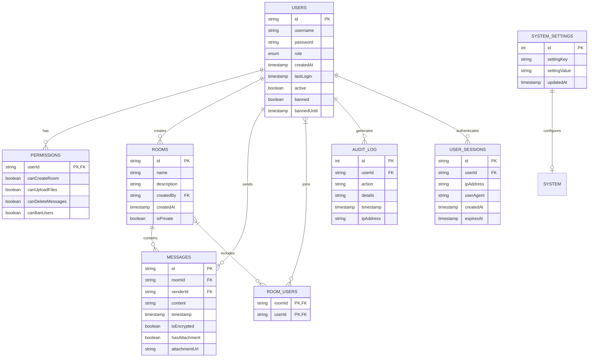

# المخطط المعماري لنظام الدردشة المشفر

## النموذج الأولي (الحالي)

## الهيكل المعماري المقترح للإنتاج

## مخطط تدفق المستخدم للمصادقة

## مخطط تدفق إرسال الرسائل المشفرة

## نموذج قاعدة البيانات (ER Diagram)

