# مخطط حالات الاستخدام (Use Case Diagram)

## حالات استخدام نظام الدردشة المشفر

```mermaid
graph TD
    Admin((المسؤول))
    Client((المستخدم العادي))
    
    subgraph نظام الدردشة المشفر
        Login[تسجيل الدخول]
        
        subgraph إدارة المستخدمين
            AddUser[إضافة مستخدم جديد]
            EditUser[تعديل بيانات مستخدم]
            BanUser[حظر مستخدم]
            ManagePermissions[إدارة الصلاحيات]
        end
        
        subgraph إدارة الغرف
            CreateRoom[إنشاء غرفة جديدة]
            EditRoom[تعديل غرفة]
            DeleteRoom[حذف غرفة]
            AddUserToRoom[إضافة مستخدم لغرفة خاصة]
        end
        
        subgraph الدردشة
            SendMessage[إرسال رسالة]
            ReceiveMessage[استقبال رسالة]
            DeleteMessage[حذف رسالة]
            SendAttachment[إرسال مرفقات]
        end
        
        subgraph إعدادات النظام
            ManageEncryption[إدارة التشفير]
            ManageSystemSettings[إدارة إعدادات النظام]
            ViewAuditLog[عرض سجل المراقبة]
        end
    end
    
    %% علاقات المسؤول
    Admin -->|يقوم بـ| Login
    Admin -->|يقوم بـ| AddUser
    Admin -->|يقوم بـ| EditUser
    Admin -->|يقوم بـ| BanUser
    Admin -->|يقوم بـ| ManagePermissions
    Admin -->|يقوم بـ| CreateRoom
    Admin -->|يقوم بـ| EditRoom
    Admin -->|يقوم بـ| DeleteRoom
    Admin -->|يقوم بـ| AddUserToRoom
    Admin -->|يقوم بـ| SendMessage
    Admin -->|يقوم بـ| ReceiveMessage
    Admin -->|يقوم بـ| DeleteMessage
    Admin -->|يقوم بـ| SendAttachment
    Admin -->|يقوم بـ| ManageEncryption
    Admin -->|يقوم بـ| ManageSystemSettings
    Admin -->|يقوم بـ| ViewAuditLog
    
    %% علاقات المستخدم العادي
    Client -->|يقوم بـ| Login
    Client -->|يقوم بـ| SendMessage
    Client -->|يقوم بـ| ReceiveMessage
    Client -.->|يمكن أن يقوم بـ إذا كان لديه صلاحية| CreateRoom
    Client -.->|يمكن أن يقوم بـ إذا كان لديه صلاحية| DeleteMessage
    Client -.->|يمكن أن يقوم بـ إذا كان لديه صلاحية| SendAttachment
    
    %% العلاقات بين الوظائف
    CreateRoom -.->|يتطلب| ManagePermissions
    SendAttachment -.->|يتطلب| ManagePermissions
    DeleteMessage -.->|يتطلب| ManagePermissions
    BanUser -.->|يتطلب| ManagePermissions
```

## تفاصيل حالات الاستخدام

### المسؤول (Admin)

1. **تسجيل الدخول**
   - تسجيل الدخول باستخدام اسم المستخدم وكلمة المرور
   - الوصول إلى لوحة تحكم المسؤول

2. **إدارة المستخدمين**
   - إضافة مستخدمين جدد
   - تعديل بيانات المستخدمين
   - حظر/إلغاء حظر المستخدمين
   - تعيين صلاحيات المستخدمين

3. **إدارة الغرف**
   - إنشاء غرف دردشة جديدة (عامة أو خاصة)
   - تعديل معلومات الغرف
   - حذف الغرف
   - إضافة/إزالة مستخدمين من الغرف الخاصة

4. **الدردشة**
   - إرسال واستقبال الرسائل في أي غرفة
   - حذف أي رسالة
   - إرسال الملفات المرفقة

5. **إعدادات النظام**
   - إدارة مفاتيح وخوارزميات التشفير
   - تعديل إعدادات النظام العامة
   - عرض سجل المراقبة

### المستخدم العادي (Client)

1. **تسجيل الدخول**
   - تسجيل الدخول باستخدام اسم المستخدم وكلمة المرور الممنوحة من قبل المسؤول

2. **الدردشة الأساسية**
   - إرسال واستقبال الرسائل النصية في الغرف المصرح له بها
   - عرض قائمة الغرف المتاحة له

3. **صلاحيات مشروطة (إذا كان مصرحًا له)**
   - إنشاء غرف دردشة (إذا كان لديه صلاحية `canCreateRoom`)
   - إرسال ملفات مرفقة (إذا كان لديه صلاحية `canUploadFiles`)
   - حذف رسائله الخاصة (إذا كان لديه صلاحية `canDeleteMessages`)

## تدفق الأحداث النموذجي

### تسجيل الدخول
1. يدخل المستخدم اسم المستخدم وكلمة المرور
2. يتم التحقق من صحة البيانات
3. إذا كانت البيانات صحيحة، يتم توجيه المستخدم إلى الصفحة المناسبة حسب دوره
4. إذا كان المستخدم مسؤولاً، يتم توجيهه إلى لوحة التحكم
5. إذا كان مستخدمًا عاديًا، يتم توجيهه إلى صفحة الدردشة

### إرسال رسالة مشفرة
1. يختار المستخدم غرفة الدردشة
2. يكتب الرسالة في حقل الإدخال
3. يضغط على زر الإرسال
4. يتم تشفير الرسالة قبل تخزينها في قاعدة البيانات
5. يتم إرسال الرسالة إلى جميع المستخدمين في الغرفة
6. يتم عرض الرسالة في واجهة المستخدم
